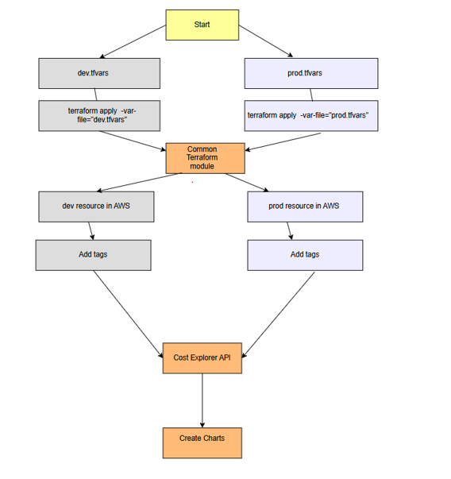

# Terraform Environments Architecture

This document outlines the architecture for two environments – **dev** (development) and **prod** (production) are created according to the following architecture.




## Architecture for dev and prod environments

- The Terraform module will contain two folders: `dev` and `prod`.
- Each folder will contain the backend `.tfvars` file, along with a `.tfvars` file for variable names.

### Initialization Commands

To initialize the environment, use the following commands:

- **Dev Environment:**
  ```bash
  terraform init -backend-config="dev/backend_dev.tfvars" -reconfigure

• To initialize into the dev/prod environment, type the command 
  o terraform init -backend-config="dev/backend_dev.tfvars" -reconfigure to use the initiate dev environment 
  o terraform init -backend-config="prod/backend_prod.tfvars" -reconfigure to use the initiate prod environment

• The module can be deployed by specifying the .tfvars file when planning or applying (e.g. terraform apply -var-file="dev/dev.tfvars")

• The resources with their respective tags will be deployed in the dev/prod environment.

• These tags then can be used to create charts for the resources.
